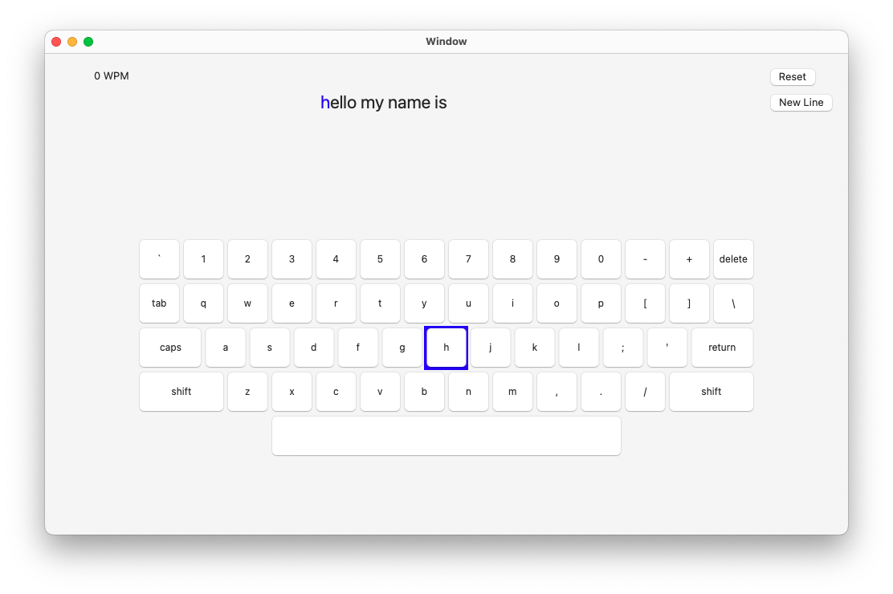

# TouchType
Lightweight typing practice application for macOS!

# Built with:
- Swift  
- AppKit  
- NSView  
- Core Graphics  

# Special Feautures:
- Words per Minute calculation  
- Custom Practice Input  
- Minimalist design  

# Forthcoming features:
- Data persistance(Core Data): save custom practice sets  
- Preset practice lessons for touch typing  
- Preset practice lessons for code typing  
- Multiple keyboard layout options  
- Typing sound effects  
             
